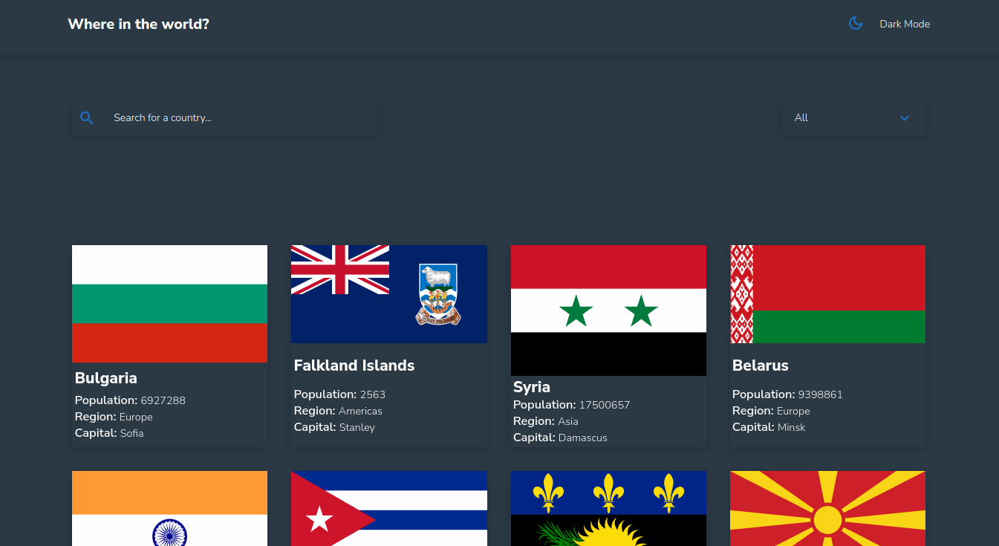
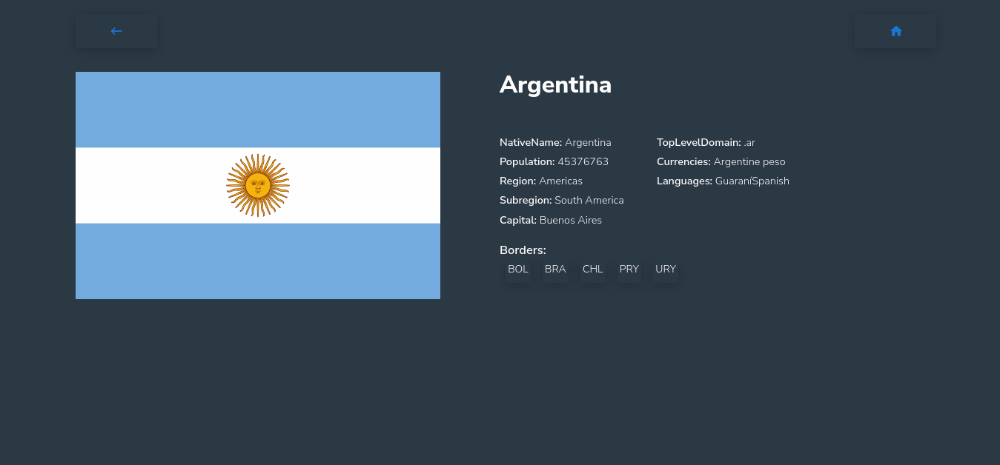
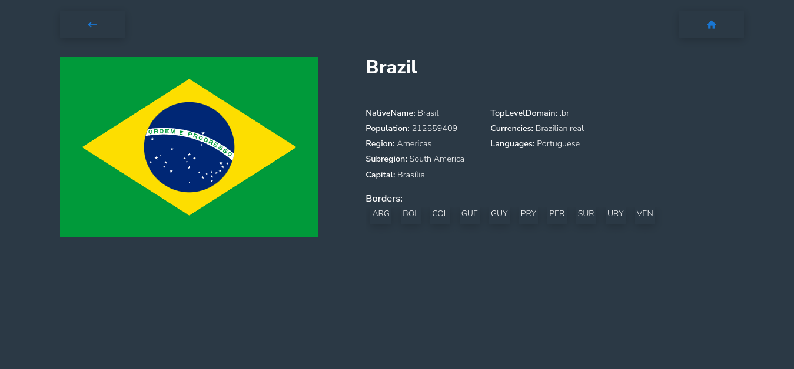
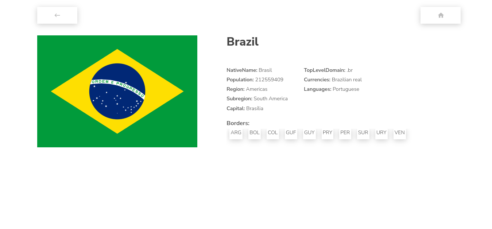
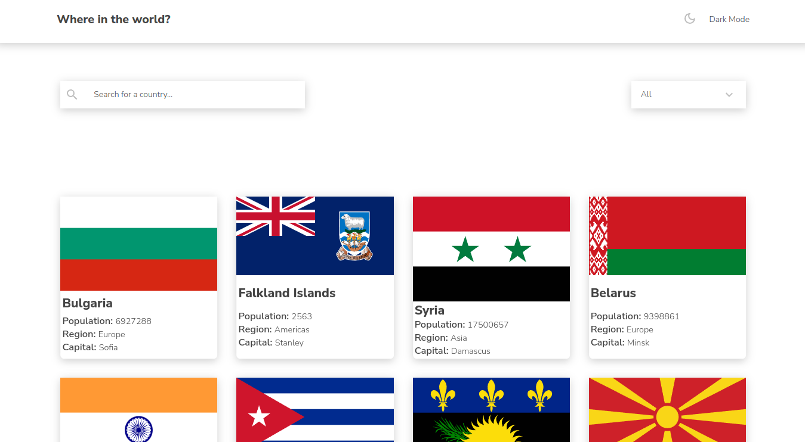
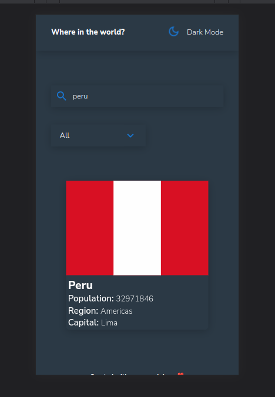
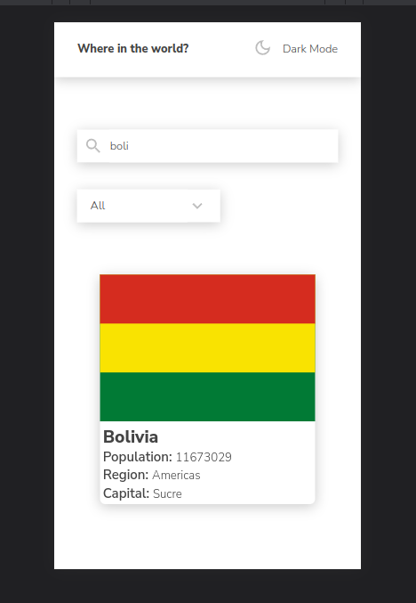
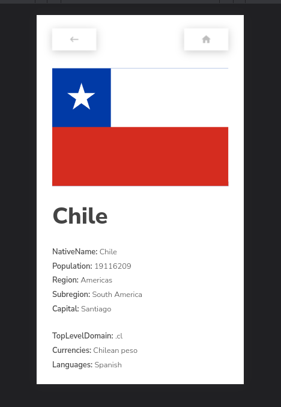
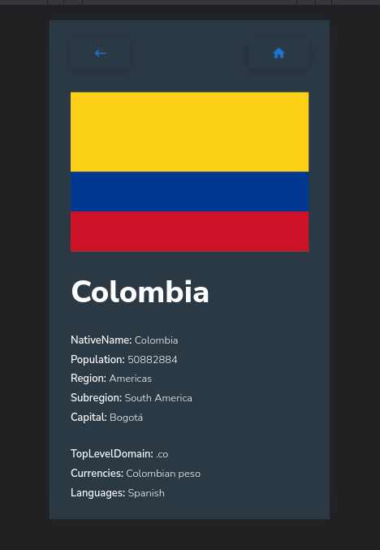

## 🌍 Countries App

#

#

#

#

#

#

#

#

### This Countries app was a [Frontend Mentor](https://www.frontendmentor.io/challenges) challenge. It was a nice experience.

#

### Technologies used in the project: _React JS_, _Styled-Component_,_Git_ and _Netlify_ for deployment.

- [LinkedIn](www.linkedin.com/in/carlosgabrielcarreno)

## See live example:

- [Link to deployment](https://countri-app-react-js.netlify.app)
